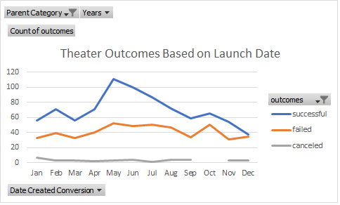
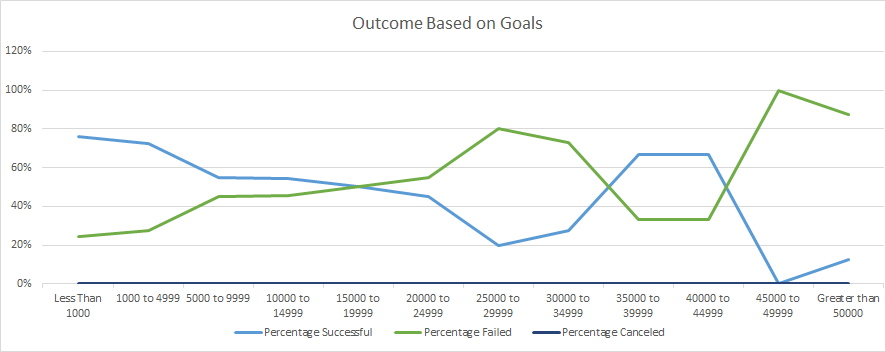

# Kickstarter-analysis with Excel
Performing analysis on Kickstarter data to uncover trends.

## Overview ofthe Analysis:

 Louise lately achieved the fundraising campaign for her play, Fever and would like to know how other campaigns implement in comparison. so Louise exactly wants to know how different campaigns fared in relation to their launch dates and funding goals, working with the data I append when Louise planned her goal, I will report to her the best month to launch her campaign and how to choose the most successful goals.

## Analysis and Challenges
Analysis of outcomes based on launch date:
  It was performed using the pivot tables in MS Excel. Here is the screenshots of pivot chart and the final pivot table to visualize the data.

Analysis of outcome based on goals:
  It depends on deliberately advanced formulas such as CountIFS, logical operators, and good excel modeling skills.
  Here is the screenshots of the final pivot chart and table.
 
 

 Challenges and difficulties encountered:
   While they did provide some information, it did not dig as deeply as I had liked to be confident the analysis is complete to satisfy Louise’s curiosity.
   So, I had a problem with understand the data and some errors occurred due to this reason, but I overcome the challenge by debugging an error, applied IFERROR formula and incorporating its solution using filters, formatting, and freezing specific columns and rows. 

## Results: 
Two conclusions for outcome based on launch date
1)	May is the most popular & best month to launch a campaign. It also yields the highest number of successful campaigns.
2)    In fact, both successful and failed campaigns are higher in May. However, January, June, July and October all had roughly the same number of failed campaigns launched.
3)	There are other influences driving success.

 
## Conclusion for Outcome based on goals 
    Success declines as goals increased. So, it’s clear that a campaign with higher goals is most likely to fail to meet them.
    
   

 
## Limitations of this dataset:
    There are various limitations for this dataset though there is enough detail information within the Kickstarter data to get the challenge done. The command for this deliverable 1 & 2 limited the analysis. For instance, there were specific directions on criteria to filter for pivot tables and charts, none of them required filtering by country nor recent years. Had such filters been included in the instructions, it would increase the readability and reliability of the data for the analysis.

## What are some other possible tables and/or graphs that we could create?
   I tried further in this analysis and included some charts during module one roundup practice with statistics that would help understand all the campaign.

